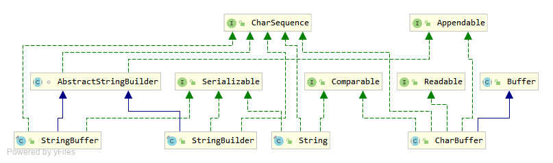
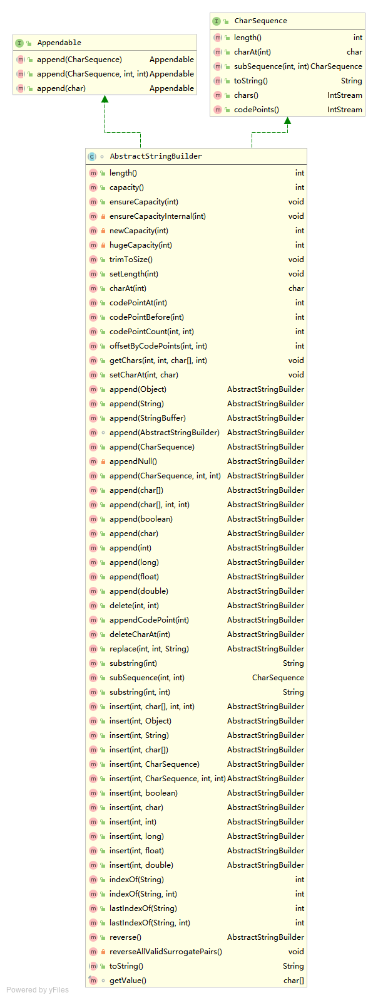
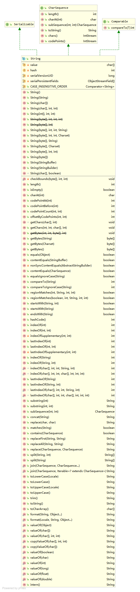
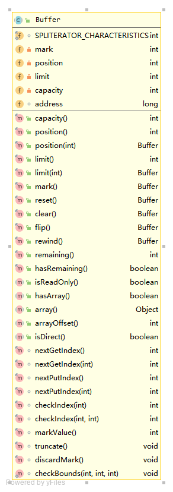

# 字符序列顶层接口定义
```java
/*
* 字符序列的基本操作：
* 获取长度 
* 获取某个位置的字符 
* 从中截取一段字符 
* 返回序列的字符串表示
*/
public interface CharSequence {
    int length();
    char charAt(int index);
    CharSequence subSequence(int start, int end);
    public String toString();
}
```
# CharSequence的继承体系

## AbstractStringBuilder

## String


    String是对象，是不可变对象，是常量 C语言中的string是char* 指针表示
    replace(逐个字符比较) replaceAll(正则表达式 Pattern Matcher)
    subString -- new String(value, beginIndex, len)
    valueOf的重载好多个
    字符串"+"操作符的重载--参考java语言规范 JavaSE 8中文版 ch15.18.1
## CharBuffer:Buffer

# 正则表达式


